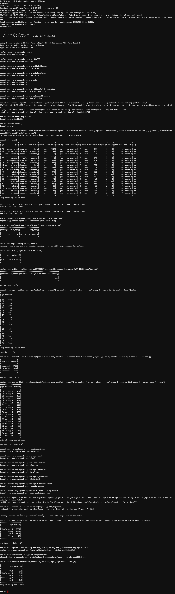

# Market Analysis in Banking Domain

## Overview

This repository contains a banking-marketing campaign analysis completed as a Scala and Apache Spark learning exercise. It uses Spark DataFrames and Spark SQL to explore customer attributes and campaign subscription outcomes, then demonstrates basic feature engineering and categorical indexing.

## Business Questions

The analysis addresses the following questions:

- What percentage of campaign records resulted in a successful or unsuccessful subscription?
- What are the maximum, minimum, and average customer ages?
- What are the average and median customer balances?
- How are successful subscriptions distributed by age?
- How are successful subscriptions distributed by marital status?
- How are successful subscriptions distributed across age and marital-status combinations?
- How can age be grouped into categories for further analysis?

## Technologies

- Scala
- Apache Spark
- Spark SQL
- Spark DataFrames
- Spark ML `StringIndexer`

## Analysis Performed

The source script:

- calculates campaign subscription success and failure rates;
- aggregates maximum, minimum, and average age;
- calculates average balance and an approximate median balance;
- groups successful subscriptions by age and by marital status;
- groups successful subscriptions by combined age and marital status;
- applies a Spark SQL UDF to engineer age categories; and
- converts the engineered age category into a numeric index with `StringIndexer`.

## Repository Structure

```text
.
├── data/
│   └── bank-marketing-dataset.csv
├── docs/
│   ├── analysis-notes.md
│   ├── problem-statement.docx
│   └── images/
│       └── spark-scala-output.png
└── src/
    └── market_analysis.scala
```

- [`data/`](data/) contains the campaign dataset used by the analysis.
- [`src/`](src/) contains the original Scala/Spark analysis script.
- [`docs/`](docs/) contains the original problem statement, analysis notes, and supporting output evidence.

### Supporting Output

The following screenshot records the analysis running in the original Spark shell environment:



## Running / Reproducing

The original script was written for a Spark/Hadoop learning environment and is not packaged as a standalone application. To reproduce the analysis, readers must:

1. configure a compatible Scala and Apache Spark environment;
2. make the CSV data source available to that environment; and
3. update the environment-specific input path in [`src/market_analysis.scala`](src/market_analysis.scala) to point to [`data/bank-marketing-dataset.csv`](data/bank-marketing-dataset.csv) or its deployed location.

The script also uses the `com.databricks.spark.csv` data-source format from its original environment. Compatibility and dependency requirements may differ in a modern Spark installation.

## Limitations

- This is an academic learning project rather than a production system.
- The original script reflects its 2020 Spark environment.
- There is no production deployment or application interface.
- No predictive model or model evaluation is claimed.
- Portability, dependency setup, and execution on a modern Spark environment have not been modernized or verified.
- The age-category UDF leaves boundary ages 20 and 33 in the `Old` category because of the original conditional ranges; the analytical logic is retained as project evidence.

## Learning Outcomes

This project demonstrates:

- distributed DataFrame operations;
- querying data with Spark SQL;
- filtering, grouping, and aggregation;
- feature engineering with a Spark SQL UDF; and
- categorical indexing with Spark ML `StringIndexer`.
